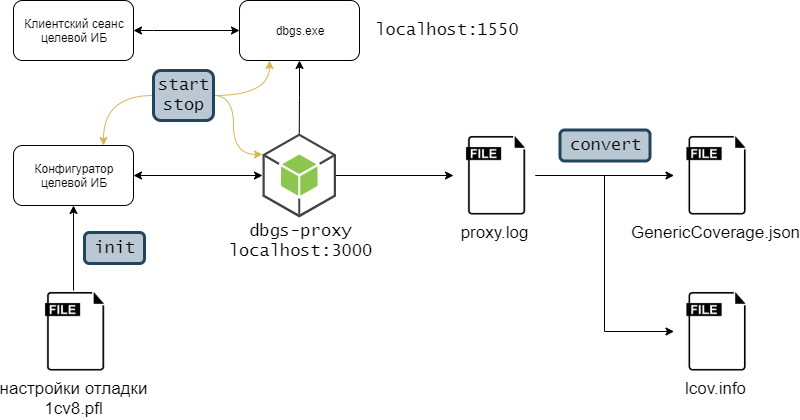

# 1coverage

## Приложение OneScript для расчета покрытия исходного кода конфигураций 1С

### Состав приложения

- dbgs-proxy - логирующий реверс-прокси для 1С на node.js
- 1coverage - приложение, которое управляет сбором замеров производительности и конвертирует их в формат [genericCoverage](https://docs.sonarqube.org/latest/analysis/generic-test/) или lcov

### Принцип работы

dbgs-proxy работает между сервером отладки и тестируемым приложением, перехватывает и сохраняет данные замеров производительности в файл. Затем приложение конвертирует этот файл в формат genericCoverage или lcov.

### Требования к окружению

- ОС Windows
- git
- OneScript 1.2
- платформа 1С версии не ниже 8.3
- Node.js
- репозиторий с исходниками конфигурации в формате XML или EDT
- проект в SonarQube, связанный с целевой конфигурацией

### Установка

Рекомендуемый способ:

- установить Node.js
- выполнить команду `opm install 1coverage` для установки самого приложения
- выполнить команду `1coverage install` для установки dbgs-proxy в каталоге приложения

### Использование

- `1coverage init`
- `1coverage start` (TODO)
- `1coverage stop` (TODO)
- `1coverage conver` (TODO)

### Запуск тестов

Для запуска всех тестов необходимо в каталоге приложения выполнить команду `opm run test`.
Выполнение тестов требует наличия [vanessa-runner](https://github.com/silverbulleters/vanessa-runner).

### Известные проблемы

- Не удалось определить Ид информационной базы.

Причины:

1) База не зарегистрирована в списке ИБ текущего пользователя.
2) База расположена вне репозитория git и была добавлена в список с помощью vanessa-runner@1.9.0 командой init-dev. Способ обхода: указать параметр `--root`, например `runner init-dev --root <КаталогПроекта>`
3) Использование библиотеки ParseFileV8i@0.0.5 совместно с vanessa-runner@1.9.0 приводит к тому, что ParseFileV8i не может найти зарегистрированную базу в списке.

### Благодарности

- [@asosnoviy](https://github.com/asosnoviy), автору [прототипа](https://github.com/asosnoviy/onecover-nodeproxy), который был взят за основу этого приложения
- сообществу [OneScript](http://oscript.io/) и [oscript-library](https://github.com/oscript-library), откуда я заимствовал наиболее удачные технические решения.
